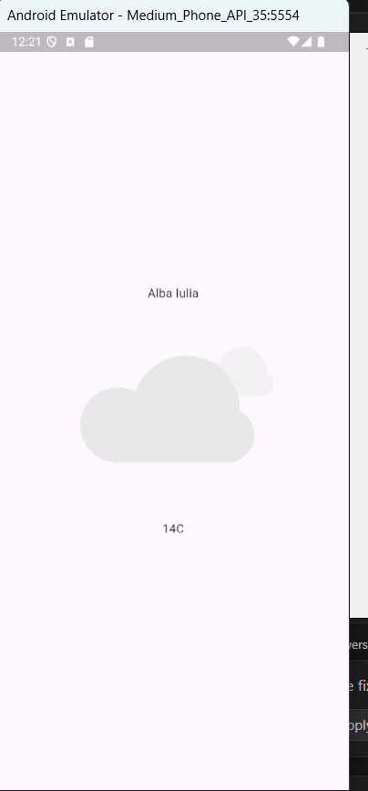

# **🌤️ Weather App – Flutter**  

## **📌 Overview**  
This is a **simple yet efficient weather application** built using **Flutter**. The app fetches **real-time weather data** based on the user's **current location**, displaying the latest temperature, weather conditions, and other useful details.  

## **⚡ Features**  
✅ **Real-time weather updates** – Get the latest weather information for your location.  
✅ **Automatic location detection** – Uses **GPS** to fetch weather data based on your **current position**.  
✅ **Minimalist UI** – A clean and user-friendly interface for quick weather updates.  
✅ **Weather details** – Displays **temperature**  
✅ **Flutter & API Integration** – Uses a **weather API** to retrieve accurate data.
